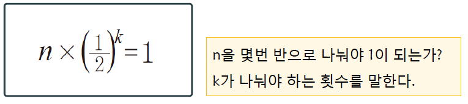
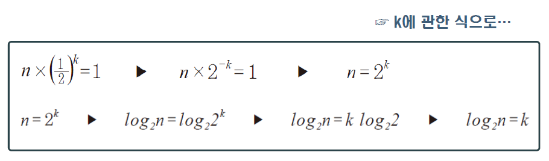
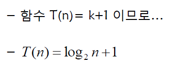
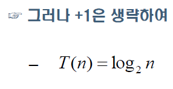

[TOC]

#이진탐색

###이진탐색의 최악의 경우 시간 복잡도.

#####시간복잡도 계산을 위한 핵심 연산은? :
**==** 연산

#####이진탐색의 최악의경우는? 
찾는 값이  ==배열에 존재 하지 않은 때==이다.

#####데이터의 수가 n개 일때 비교 연산의 횟수

처음에 n개일때 1회
-> 그다음 데이터의 수를 반으로 줄여 n/2
-> 그다음 데이터의 수를 반으로 줄여 n/4

==이 얼마인지 결정 되지 않았으니 이 사이에 도대체 몇 번의 비교연산이 진행되는지
알 수 없다.==

마지막으로 데이터의 수가 1개일 때 1회의 비교연산 진행!.

- - -

#####따라서 비교연산의 횟수를 구한다면 수학의 공식을 빌려야한다.

ex)8이 1이 되기까지 2로 나눈 횟수 **3회** 와 마지막 데이터가 1개일때 **1회**

그러므로

n이 1이 되기까지 2로 나눈 횟수 **k회** 데이터가 1개일때 **1회***

**T(n) = k+1**

여기서 뜬금없이 k가 등장했으므로 n과 관련된 식으로 바꾸어 주어야 함!

#####이제 됐다!

#####결론이 나떠용

